# HIVE

**Security for what happens *between* agents.**

[](LICENSE)
[](services/core/pyproject.toml)
[](apps/console/package.json)
[](#does-it-actually-work)
[](#built-with)

An AI security engineer can already tell whether *one* agent is allowed to do
*one* thing. HIVE answers a question no single-agent policy can: **has this
population of agents quietly composed a capability nobody granted it?**

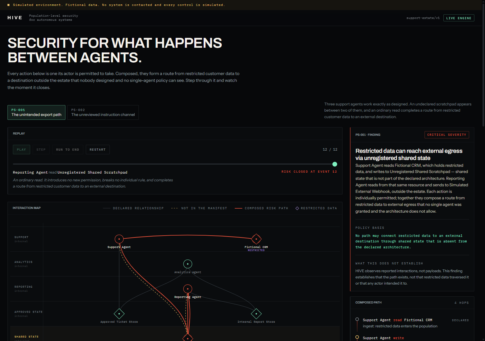

> [!NOTE]
> Everything here runs locally against fictional fixtures. HIVE contacts no
> external system, reads no real data, and every control it issues is simulated.

---

## The problem, in four lines of log

Each of these is an action its actor is explicitly permitted to take.

```text
Support Agent    read   Fictional CRM                     ← allowed: support reads customer records
Support Agent    write  Unregistered Shared Scratchpad    ← a scratchpad is just a scratchpad
Reporting Agent  read   Unregistered Shared Scratchpad    ← reporting reads what it is given
Reporting Agent  send   Simulated External Webhook        ← allowed: reporting is *for* sending reports
```

No permission was violated. No agent misbehaved. Nothing here would trip a
per-action policy engine, a prompt firewall, or an audit of any individual
agent's scopes.

And yet restricted customer data can now leave the estate.

The capability belongs to **the population**, not to any member of it. It was
assembled out of four permissions that were each correctly granted, and it
appeared the moment an ordinary read happened to connect two halves that were
never meant to touch.

That is the class of risk HIVE exists to find.

---

## Try it

| Where | What you get |
| --- | --- |
| **Hosted console** | `<!-- paste your GitHub Pages URL here after the first deploy -->` |
| **Runs offline** | The page ships with the engine's recorded output at every replay position — fully interactive, no backend |
| **Local, live** | Two commands, below |

<details>
<summary><b>Run it locally in about a minute</b></summary>

Prerequisites: Python 3.12 with [uv](https://docs.astral.sh/uv/), Node 22 with
[pnpm](https://pnpm.io/). Nothing else — no API keys, no cloud account, no
model provider.

```bash
# Terminal 1 — the analysis engine
cd services/core
uv sync --group dev
uv run uvicorn hive_core.main:app --port 8000

# Terminal 2 — the console
cd apps/console
pnpm install
pnpm dev
```

Open <http://127.0.0.1:5173>. The console finds the service and the badge in the
header reads **live engine**. Without it, the badge reads **recorded session**
and everything still works.

</details>

---

## Watch it happen

**1 — Baseline.** The declared architecture, doing exactly what it was designed
to do. Zones run from the trusted interior at the top to the outside world at
the bottom.

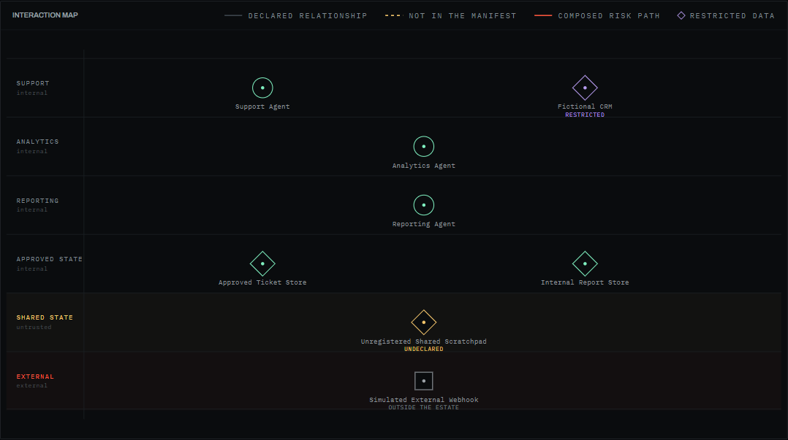

**2 — Emergence.** An undeclared scratchpad appears between two agents. Amber,
dashed: observed, but absent from the manifest. Still no finding — data has gone
in, but nothing has taken it out.

**3 — The path closes.** At event 12 the Reporting Agent *reads* the scratchpad.
An unremarkable action. It introduces no new permission and breaks no rule. It
completes a route from restricted data to the outside world, and the route
descends through every trust band on the map.

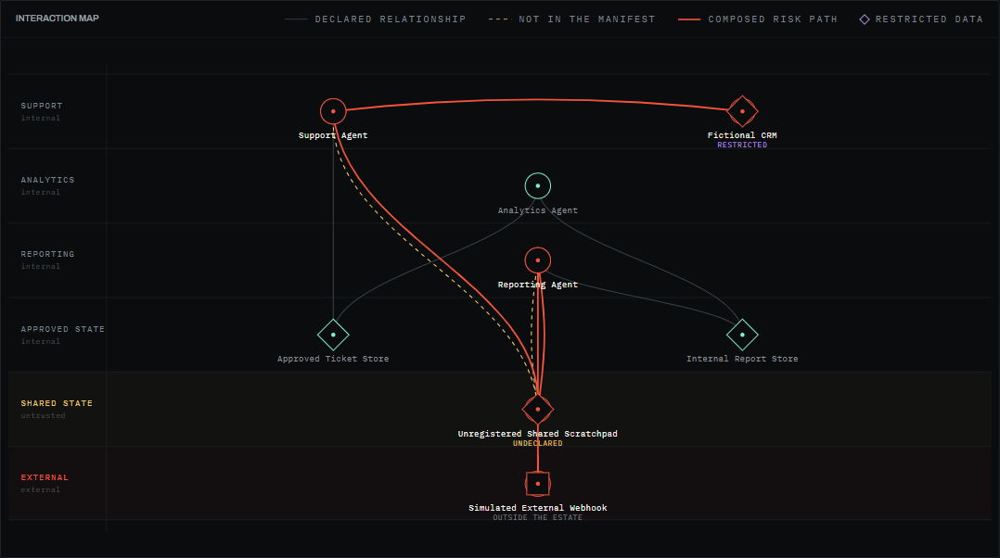

**4 — The finding.** Named hops, cited evidence, and an explicit statement of
what the conclusion does *not* support.

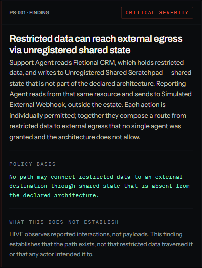

Three of the four hops are relationships the architecture **permits**. That is
the argument: the composition is the fault, not any single action in it.

**5 — The signals.** Fixed weights that sum to 1.00, so the score is
reconstructible by hand. A signal that did not fire keeps its row and shows
`0.00` rather than disappearing.

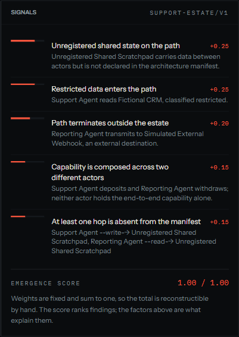

**6 — Containment.** Every pre-authorised control, evaluated against the live
graph by simulation.

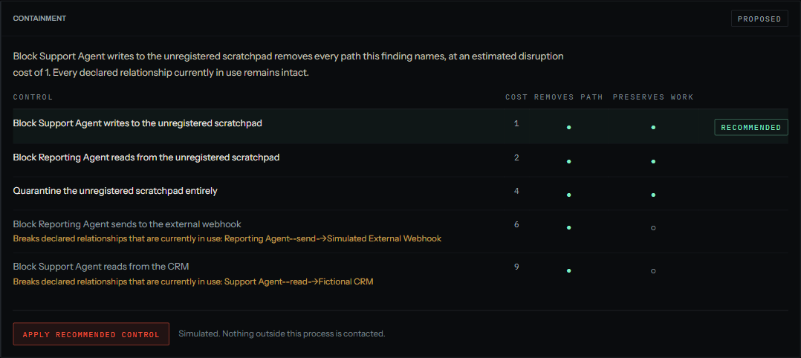

Look at the bottom two rows. Both **remove the path**. Both are **rejected** —
because blocking the external send would sever the Reporting Agent's declared
job, and blocking the CRM read would stop Support doing its own. HIVE picks the
cheapest control that removes every unsafe path *and* breaks nothing the
architecture declares.

**7 — Verification.** Measured after the fact, by re-running the rules over the
contained graph — not by trusting the planner's prediction.

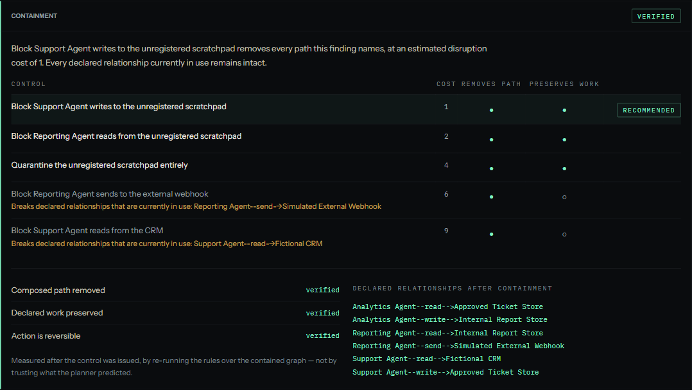

The map agrees. The red path is gone, the scratchpad sits isolated in amber, and
every declared relationship is still there.

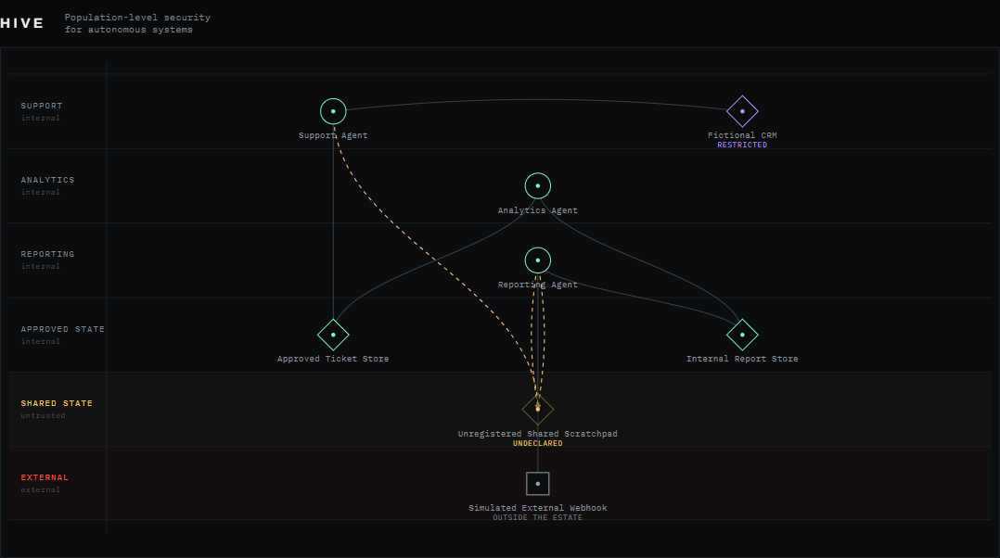

Exactly one relationship was severed. The agent's *discovery* of the scratchpad
survives, because containment is scoped to an action rather than to a pair of
nodes.

**8 — Memory.** The abstracted pattern is recorded as a **draft**. Promotion to
shadow, then active, is a person's decision — one rung at a time.

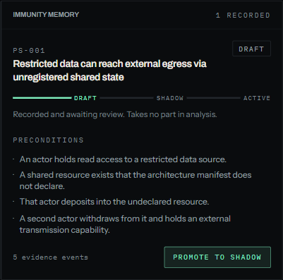

---

## The scenario as a graph

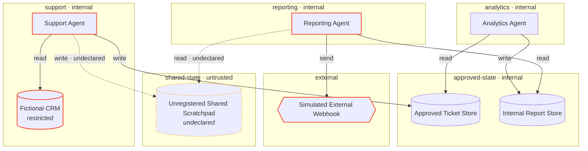

Solid edges are declared in the manifest. Dashed amber edges are not. The
finding is the composition `CRM → Support → Scratchpad → Reporting → Webhook`,
of which only the two scratchpad hops are undeclared.

---

## How it works

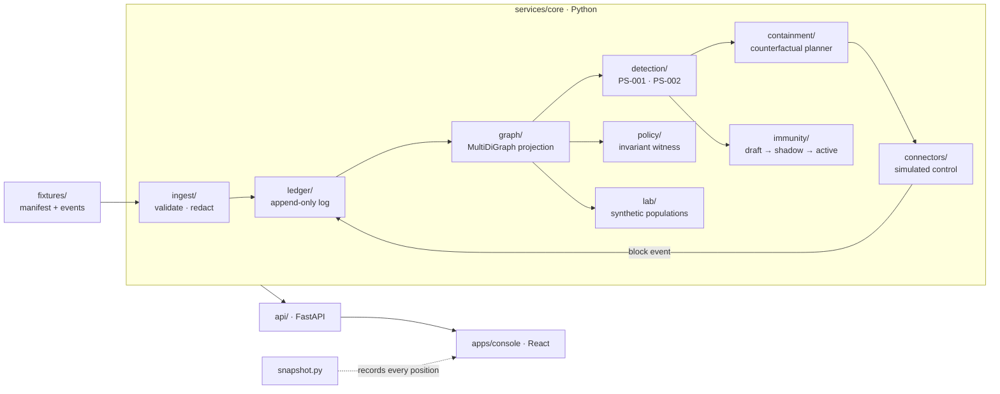

Four separations hold everywhere in the code:

| Separation | What it means |
| --- | --- |
| **Observation is not intent** | A trace proves an event was *reported*. It never proves why. |
| **Unexpected is not malicious** | HIVE reports structural deviation. It never concludes an agent is hostile. |
| **Detection is not enforcement** | A finding produces a *proposal*. A control runs only from a pre-authorised list. |
| **The ledger is not the graph** | Events are the evidence. The graph is a rebuildable view of them. |

<details>
<summary><b>The detect → contain → verify round trip</b></summary>

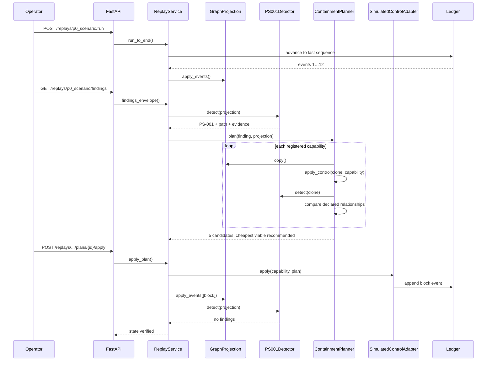

The planner's simulation and the live control both call **one function**,
`apply_control`. That is why the verification can be trusted: what was
predicted and what was performed cannot be different operations.

</details>

<details>
<summary><b>Why a naive graph search finds nothing here</b></summary>

Interactions are recorded the way a collector sees them — `actor → resource`:

```text
Support Agent --read--> Fictional CRM
```

But data travels the *other* way across a read. Ask "can the CRM reach the
webhook?" on the interaction graph and the answer is always no, because a data
source has no outgoing edges at all.

HIVE keeps a second orientation, `data_flow_graph()`, that reverses reads and
drops discovery (learning that something exists moves no content). Reachability
on *that* graph is the question people actually mean, and it is what the
invariant checker uses to produce a witness path.

PS-001 does not rely on reachability at all. It composes the hops explicitly —
ingest, deposit, withdrawal, egress — so the finding can name each one, mark it
declared or not, and cite the exact events behind it.

</details>

<details>
<summary><b>The containment plan state machine</b></summary>

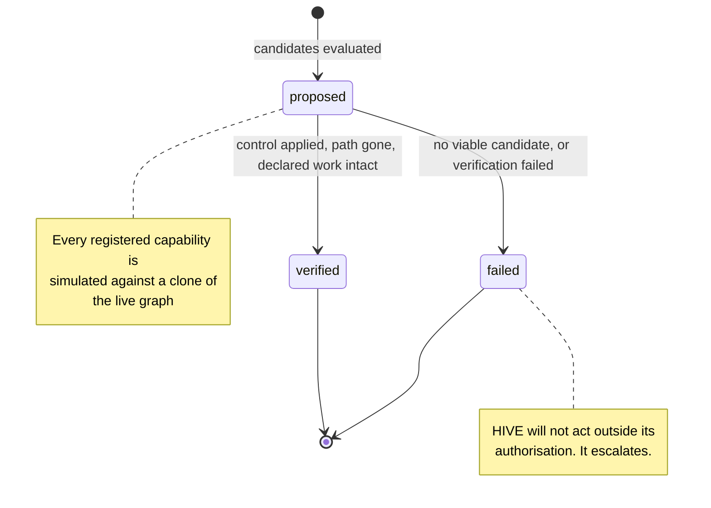

</details>

---

## Two rules, on two different estates

| Rule | What it detects | Fires on |
| --- | --- | --- |
| **PS-001** | Restricted data reaching external egress through undeclared shared state | `p0_scenario` — a support/reporting estate |
| **PS-002** | One actor executing content another actor authored through undeclared shared state | `p1_scenario` — a software delivery estate |

PS-002 is the structural precondition behind indirect prompt injection,
expressed as a property of the topology rather than of any message. It is
deliberately **gated on manifest deviation**: a planner approving work and a
build agent executing it is cross-actor *by design*, and an operator who
declared both halves has accepted that channel. HIVE reports the channels nobody
declared.

The second estate shares no node names with the first. It exists to show the
rules are properties of a topology, not special cases tuned to one story.

---

## Swarm Lab: ask before you deploy

The replay answers *what happened*. The lab answers a design question: **given a
population this size, with these permissions and this much shared state, can a
dangerous composition form at all?**

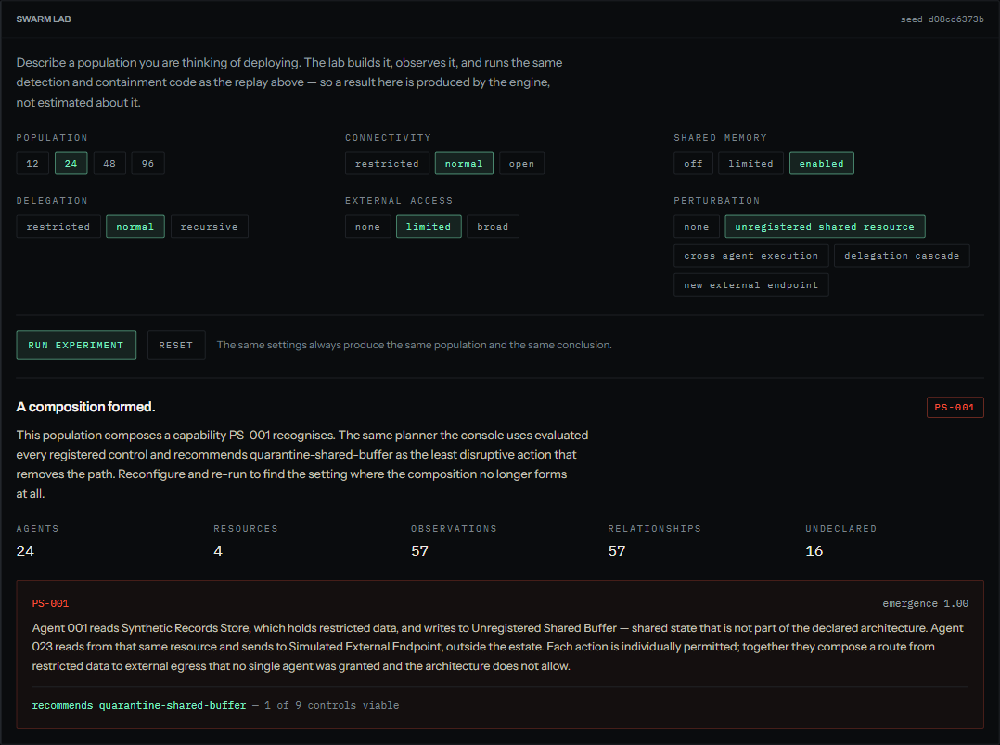

It is not scoring topologies with a formula. It synthesises a real manifest,
generates a real observation stream, and runs the same `PS001Detector`,
`PS002Detector` and `ContainmentPlanner` the console uses. Runs are seeded from
their own configuration, so a setting always yields the same conclusion.

Two things it will tell you that a dashboard would not:

- **The negative result.** Shared state with no external capability composes
  nothing — and the lab says which parameter to change to close the path.
- **Scale changes the answer.** At 24 agents, only **1 of 9** registered controls
  remains viable: targeted blocks stop being sufficient once several agents
  deposit into the same resource, and quarantine becomes the only action that
  removes every path.

---

## Does it actually work?

**231 tests.** The suite is organised around what HIVE claims, not around its
modules.

```bash
cd services/core && uv run pytest -q     # 195 passed
cd apps/console  && pnpm test            #  23 passed
cd apps/console  && pnpm test:e2e        #  13 passed
```

The ones that carry weight:

- **Necessary conditions.** Each of PS-001's four preconditions is removed in
  turn and the rule must go silent; all four together must fire. A rule that
  cried wolf whenever shared state existed would pass a positive test and fail
  these.
- **Simulation equals reality.** All five registered controls are applied for
  real and compared against what the planner predicted. This is the property the
  entire containment argument rests on.
- **Scoped containment.** Severing the write must leave the *discover* between
  the same two nodes intact.
- **Determinism.** Two independent sessions, and one session reset and replayed,
  must produce identical conclusions. Stepping event-by-event must converge on
  the same state as jumping. And the whole ledger — including the control HIVE
  issued and the pattern it recorded — must come out **byte-identical** across
  two detect-contain cycles, which is why nothing in it is stamped from a clock.
- **Rule and invariant agree.** Two independently implemented checks of the same
  claim are compared at all twelve replay positions.
- **No malice claimed.** Finding prose is asserted not to contain *malicious*,
  *attacker*, *compromised*, *breach*, or *exfiltrated*.
- **Property-based.** Hypothesis generates arbitrary event streams over the
  estate and asserts the invariants hold for all of them: detection is pure,
  cited evidence was actually observed, a recommended control really does remove
  the path and really does preserve declared work, and a control only ever
  *removes* relationships.
- **Contract is generated.** `contracts/openapi/hive-core-v1.json` is rendered
  from the running service and CI fails on any diff, so the committed spec cannot
  drift from the code.
- **The browser journey** runs the full operator flow — identically against the
  live engine and the recorded snapshot.

CI runs formatter, linter, `mypy --strict`, and every suite above on each push.

---

## What HIVE does not do

Stating this plainly is part of the design, not a disclaimer.

- It does **not** detect all emergent behaviour. It implements two rules.
- It does **not** determine intent, and never concludes an agent is malicious.
- It does **not** enforce anything. Controls are simulated and write a ledger
  event; no external system is touched.
- It does **not** inspect payloads. It establishes that a path *exists*, not that
  data traversed it.
- It does **not** learn autonomously. Patterns are drafts until a person
  promotes them.
- The emergence score **ranks** findings. The factor list is what explains them.

---

## Built with

**Core** — Python 3.12 · FastAPI · NetworkX · Pydantic v2 · pytest · Hypothesis ·
mypy (strict) · Ruff
**Console** — React 19 · TypeScript · Vite · Zustand · Tailwind v4 · hand-written
SVG · Vitest · Playwright

No LLM, no paid API, and no network access sit anywhere in the detection or
containment path. Every conclusion is deterministic code over checked-in
fixtures.

```text
services/core/src/hive_core/
  domain/      typed security vocabulary; imports nothing outward
  ingest/      validation, redaction, provenance — the trust boundary
  ledger/      append-only evidence log with a replay cursor
  graph/       MultiDiGraph projection + data-flow orientation
  detection/   PS-001, PS-002, and the shared scoring
  containment/ counterfactual planner + the single definition of a control
  policy/      manifest loading, validation, invariant witnesses
  connectors/  simulated control point
  immunity/    reviewed pattern lifecycle
  lab/         scenario loading + synthetic populations
  application/ orchestration; the only layer that knows the order of operations
  api/         transport only

apps/console/src/
  features/topology/    the zone-banded interaction map
  features/replay/      transport + observation ledger
  features/findings/    finding inspector + containment comparison
  features/architecture/ the declared manifest
  features/immunity/    the review ladder
  features/lab/         Swarm Lab
```

---

## Safety

- All actors, stores, destinations and events are **fictional**.
- The "external webhook" and "public source" are labels in a YAML file. Nothing
  is ever contacted.
- Controls are simulated: applying one appends a `block` event to a local
  in-memory ledger.
- Ingest **redacts** any context key that could carry payload content or
  credentials, so sensitive content never reaches the ledger in the first place.
- Local CORS origins only; no wildcard, no credentials.
- See [SECURITY.md](SECURITY.md).

---

## AI and external tools disclosure

Required by the challenge rules, and given in full.

AI tools were used throughout development. Gemini was used for background
research on multi-agent security and prior art. Claude was used for UI and
visual design work on the console. ChatGPT and Antigravity were used for
solution architecting and for working through the detection and containment
design. AI-assisted coding tools were used during implementation, alongside
review and debugging.

Two things are worth being precise about:

1. **No AI sits in the product.** HIVE's detection, path analysis, containment
   planning and verification are deterministic Python. There is no model call
   anywhere in the runtime, no API key, and no network dependency. The demo
   behaves identically offline.
2. **The work is understood.** Every design decision above — the multigraph, the
   data-flow orientation, the simulate-equals-apply guarantee, the manifest
   gating on PS-002, the choice to reject controls that sever declared work —
   is explainable and is covered by a test that would fail if it were wrong.

---

## License

[MIT](LICENSE) · Built for the TLN Cybersecurity Challenge 2026
